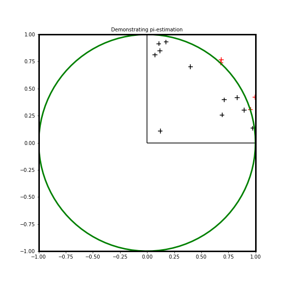

# Estimating value of π using geomtric way
Geometric way to estimate value of π

Consider the figure below

Consider a circle of radius r, in the figure above. Each side of the square will be 2r. Area of this circle will be  π$  r^2 $; area of the square will be 4 $ r^2 $. Ratio of the area of the circle to the square will be π/4.

If we consider just the quarter of the circle and the square the ratio will be still in intact.

So what we do here is, choose random points between 0 and 1; that is the highlighted quarter of the square. Then we determine if they lie within the circle or not, using the formula -

Given the radius of the circle, r
\begin{equation}
  x^2+y^2=r^2
\end{equation}

The ratio of the number of points that fall within the radius of the circle, 1, to four times total number of points, will be the value of $\{pi}$, for the given trial.

The notebook here uses ipywidgets, to control the number of points used in each trial; also to control the number of times we calculate the value of π.
