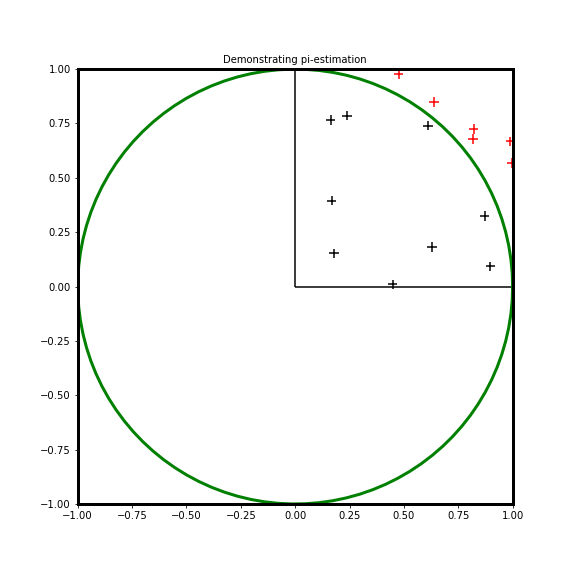

# Estimating value of π using geomtric way
Geometric way to estimate value of pi

Consider the figure below

Consider a circle of radius r, in the figure above. Each side of the square will be 2r. Area of this circle will be  $\pi r^2$; area of the square will be 4 $r^2$. Ratio of the area of the circle to the square will be $\pi/4$.

If we consider just the quarter of the circle and the square the ratio will be still in intact.

So what we do here is, choose random points between 0 and 1; that is the highlighted quarter of the square. Then we determine if they lie within the circle or not, using the formula -

radius of the circle, r = $\sqrt(x^2 + y^2)$
